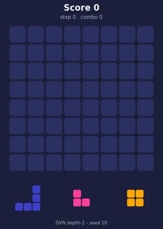

# Reinforcement Learning for Block Blast

[](https://github.com/NathanDuboisset/RL_project/actions/workflows/tests.yml)
[](report/report.pdf)

Agents that learn to play **Block Blast**, the 8×8 block-placement puzzle:
Deep Q-Networks, a **Deep Value Network on afterstates** combined with
lookahead search, and **PPO with an exhaustive round planner**.

<p align="center">
  <br>
  <sub>DVN depth-2 lookahead playing the 3-piece game (seed 10; a shorter-than-median game,
  chosen so the GIF ends with a game over).</sub>
</p>

Project of the Reinforcement Learning course (CSC_52081) at École polytechnique,
by Nathan Duboisset, Roman Lendormy, Arthur Fournier, Keyvan Attarian and Arthur Paing.
Full report: [`report/report.pdf`](report/report.pdf).

## Highlights

- **Afterstates make the problem easy to learn.** Instead of `Q(s, a)` over 64
  or 192 placements, the DVN learns a value `V(s')` of the board *after* a move.
  A 54k-parameter CNN outperforms 2.7M-parameter DQN agents.
- **A value function learned on the 1-piece game transfers to the real game**
  when used as the leaf evaluation of a short search over the 3 pieces of a round.
- **PPO + exhaustive round search** is the strongest agent: ~687 placements per
  game on average versus ~27 for the PPO policy alone.

| Game | Agent | Mean return | Mean length (placements) | Source |
|---|---|---:|---:|---|
| 1 piece | Random | −45 | 11 | notebook 2 (300 episodes) |
| 1 piece | Greedy (immediate reward) | 259 | 30 | notebook 2 |
| 1 piece | DVN | 855 | 62 | notebook 2 |
| 3 pieces | Greedy depth-2 | 1,885 | 44 | report, Table 2 (250 episodes) |
| 3 pieces | DVN depth-2 | 23,413 | 209 | report, Table 2 |
| 3 pieces | PPO policy | 280 | 27 | report, Fig. 8 |
| 3 pieces | PPO + round search (α = 0.3) | 451,371 | 687 | report, Fig. 8 |

Returns are heavy-tailed (a few very long games), so medians and confidence
intervals are reported in the notebooks.

## Notebooks

| | |
|---|---|
| [01 · Environment](notebooks/01_environment.ipynb) | rules, observations, why the problem is hard |
| [02 · DQN vs DVN, 1 piece](notebooks/02_dqn_vs_dvn_1p.ipynb) | afterstate value learning, evaluation, what the value network prefers |
| [03 · Planning, 3 pieces](notebooks/03_planning_3p.ipynb) | lookahead with the DVN, greedy baselines, PPO + round search |

## Quick start

```bash
uv sync                          # Python >= 3.11; installs the project in .venv
uv run pytest -m "not slow"      # unit, learning and performance tests (~1 min on CPU)
uv run pytest                    # + end-to-end runs of every script (~2 min)

# evaluate the trained DVN
python -m dvn.benchmark_1p --checkpoint final_weights/dvn_final_20260313_020137.pt
python -m dvn.benchmark_3p --checkpoint final_weights/dvn_final_20260313_020137.pt \
    --policies dvn-d2 greedy-d2 random --episodes 250

# train
python -m dqn.train --agent ddqn            # or --agent rainbow
python -m dvn.train                         # add --wandb to log to Weights & Biases
python -m ppo.train --steps 1000000

# PPO planners (needs a PPO checkpoint, not versioned: put it in checkpoints/)
python -m ppo.value_weight_sweep --checkpoint checkpoints/ppo/<ckpt>.pt
python -m ppo.benchmark_3p --checkpoint checkpoints/ppo/<ckpt>.pt --value-weight 0.3

# record a game
python -m dvn.demo --seed 10 --out assets/dvn_3p.gif
```

All evaluations are seeded: episode `i` uses seed `seed + i`, and the pieces only
depend on the seed, so policies are compared on the same piece sequences.

## Repository layout

```
src/
  blockblast/   Gymnasium environments (1P, 3P) and game-like rendering
  common/       base agent, seeded evaluation loop, baselines, plots
  dqn/          DDQN and Rainbow (PER, n-step, noisy nets, dueling, C51)
  dvn/          Deep Value Network, lookahead policies, round planner, benchmarks
  ppo/          PPO actor-critic, round-search planners ("MCTS"), benchmarks
notebooks/      presentation notebooks (executed)
final_weights/  trained DVN weights
plots/          figures of the report
report/         the report (PDF)
tests/          pytest suite: environments, agents, planners, learning sanity checks,
                performance of the trained DVN, end-to-end scripts (run by GitHub Actions)
```

### Where each part of the report lives

| Report | Code |
|---|---|
| §2 Environments 1P / 3P, reward shaping | `src/blockblast/block_blast_env.py`, `src/blockblast/block_blast_3p_env.py` |
| §3 DDQN, Rainbow, `BlockBlastCNNNet1P` | `src/dqn/` |
| §4.1–4.3 DVN on afterstates, multi-kernel CNN, training | `src/dvn/agent.py`, `src/dvn/models.py`, `src/dvn/train.py` |
| §4.4 1P benchmark | `src/dvn/benchmark_1p.py` |
| §4.5 `RoundPlanner3P` | `src/dvn/planner.py` |
| §4.5 Table 2, Fig. 3–5 (DVN / greedy depth-2/3) | `src/dvn/lookahead.py`, `src/common/policies.py`, `src/dvn/benchmark_3p.py` |
| §5.1–5.2 PPO | `src/ppo/ppo_agent.py`, `src/ppo/train.py` |
| §5.3 "MCTS" First Only / Full Triplet, Fig. 6 | `src/ppo/mcts_agent.py`, `src/ppo/value_weight_sweep.py` |
| §5.4 Fig. 8 | `src/ppo/benchmark_3p.py` |

Exploratory experiments not used in the report were removed but they remain in the
git history (tag `pre-refactor`).

## Weights

| File | Network | Notes |
|---|---|---|
| `final_weights/dvn_final_20260313_020137.pt` | `BlockBlastValueNet1PmultikernelFlattenned`, 54,529 parameters | final DVN: 1P results (~62 placements) and all 3P results |
| `final_weights/dvn_1P_60avg.pt` | `BlockBlastValueNet1P`, plain CNN, 1,345,121 parameters | earlier DVN (~52 placements in 1P) |

`dvn.agent.load_dvn_agent(path)` picks the right network from the weights.
